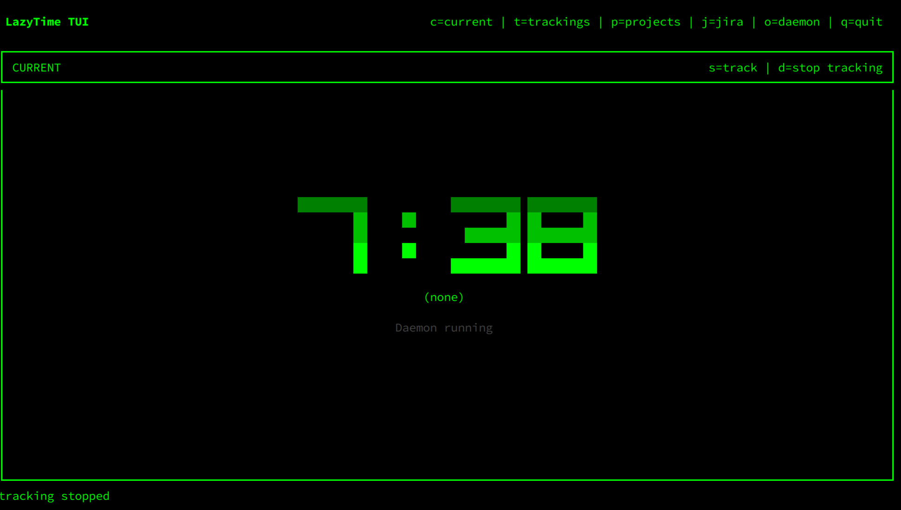

# LazyTime

LazyTime is an automatic, rule-driven time tracking assistant. It watches your active window title/app, maps that to projects using your rules, and keeps trackings up to date.



## Quick Start (for users)

1. Install/build `lazytime` and run it:

```bash
lazytime
```

2. By default, LazyTime starts the TUI. On TUI startup it also auto-starts the daemon (if no daemon is already running outside TUI), so it works out of the box.

3. Open `Current` view (`c`) to see:
   - current active tracking,
   - total tracked time today,
   - daemon state (`Daemon running`, `Daemon stopped`, or `Daemon running outside TUI`).

4. Add your projects/rules in `Projects` view (`p`) so window activity can be mapped automatically.

## Configuration

A config file is created automatically on first run if it does not exist.

- Use a custom config file with `--config /path/to/config.json`.
- Core settings include default project, DB path, reminders, report range, Jira config, and IPC endpoint override.

### Config options

| Key | Type | Default | Required | Description |
|---|---|---|---|---|
| `default_project` | `string` | `"Default"` | Yes | Fallback project name used when no rule matches. Must be non-empty. |
| `tracking_stability_seconds` | `u64` | `60` | No | Minimum seconds before daemon auto-switches an already running tracking to a newly detected project. |
| `working_hours` | `object` | `{}` | No | Map of weekday (`0..6`, Monday=0) to time ranges. Reminders are only due inside these ranges. |
| `track_reminder_seconds` | `u64` | `300` | No | Delay before asking again after choosing **No** in reminder popup. |
| `track_reminder_snooze_seconds` | `u64` | `1800` | No | Snooze duration for reminder popup and manual stop auto-tracking snooze window. |
| `summary_update_seconds` | `u64` | `5` | No | Refresh interval for `lazytime --summary --watch`. |
| `report_start` | `string \| null` | `null` | No | Default report start date (`YYYY-MM-DD`) when `--report` is used without `--start`. |
| `report_end` | `string \| null` | `null` | No | Default report end date (`YYYY-MM-DD`) when `--report` is used without `--end`. |
| `db_file` | `string` | OS-dependent data path | Yes | SQLite database file path. Parent directories are created automatically. |
| `jira_url` | `string \| null` | `null` | No | Jira base URL (for example `https://your-company.atlassian.net`). |
| `jira_token` | `string \| null` | `null` | No | Jira API token used for sync requests. |
| `jira_email` | `string \| null` | `null` | No | Jira account email used with token auth. |
| `jira_project` | `string \| null` | `null` | No | Default Jira project key for auto-created issues/worklogs. |
| `jira_assignee` | `string \| null` | `null` | No | Default Jira assignee for created issues (account id / username, depending on Jira setup). |
| `jira_issue_type` | `string` | `"Story"` | No | Jira issue type used when creating issues. |
| `jira_sap_field` | `string` | `"sap_project"` | No | Jira custom field key used to store SAP/project mapping metadata. |
| `ipc_socket_path` | `string \| null` | `null` | No | IPC endpoint override. Unix socket path when `ipc-unix`; host:port when `ipc-tcp`. |

`working_hours` value format:

| Field | Type | Description |
|---|---|---|
| `working_hours.<weekday>` | `array` | List of active time ranges for that weekday (`0=Mon ... 6=Sun`). |
| `working_hours.<weekday>[].start` | `"HH:MM"` | Range start (24h). |
| `working_hours.<weekday>[].end` | `"HH:MM"` | Range end (24h). |

### Config/Data locations by OS

- Linux (default)
  - Config: `~/.config/lazytime/config.json`
  - Data DB: `~/.local/share/lazytime/lazytime.db`
  - IPC (when `ipc-unix`): `~/.local/run/lazytime.sock` (or `ipc_socket_path` override)

- macOS
  - Config: `~/Library/Application Support/lazytime/config.json` (or fallback `~/.config/lazytime/config.json`)
  - Data DB: `~/Library/Application Support/lazytime/lazytime.db` (or fallback `~/.local/share/lazytime/lazytime.db`)
  - IPC (recommended): TCP loopback, e.g. `127.0.0.1:43123` when `ipc-tcp` enabled

- Windows
  - Config: `%APPDATA%\lazytime\config.json`
  - Data DB: `%LOCALAPPDATA%\lazytime\lazytime.db`
  - IPC (recommended): TCP loopback, e.g. `127.0.0.1:43123` when `ipc-tcp` enabled

Notes:

- Paths come from OS-standard directories when available (`dirs` crate).
- If `db_file` is set in config, that path is used.
- If `ipc_socket_path` is set in config, that endpoint is used.

## Project setup (required)

Automatic tracking depends on project rules. First-time setup:

1. Open TUI: `lazytime`
2. Go to Projects view: `p`
3. Add project: `a`
4. Add one or more rules for that project (app + title regex)

Rule behavior summary:

- Rules map `(app_id, title regex)` to a project.
- `app_id == "*"` means title-only fallback rule (match any app by title).
- If no rule matches, LazyTime uses your configured default project.

## How tracking works

In normal usage:

- The daemon listens for active-window changes and lock/unlock events.
- On window change, LazyTime detects project from rules and starts/switches tracking.
- On lock, active tracking is paused; on unlock, resume options are offered.
- In Current view:
  - `s` starts tracking manually,
  - `d` stops current tracking.

## Jira sync

LazyTime can sync finished trackings to Jira.

- Configure Jira fields in `config.json` (`jira_url`, token, email, project, etc.).
- Run one-shot sync from CLI:

```bash
lazytime --jira-sync
```

- Or use TUI Jira view (`j`) for interactive sync controls/logs.

## Common commands

- `lazytime` -> start TUI (default)
- `lazytime --daemon` -> daemon only
- `lazytime --summary` -> print today summary
- `lazytime --summary --watch` -> continuously refresh summary
- `lazytime --report --start YYYY-MM-DD --end YYYY-MM-DD` -> report range
- `lazytime --waybar_state` -> one JSON line for waybar

## Troubleshooting stale daemon lock

LazyTime stores a daemon runtime lock in SQLite (`config_store.key = "daemon_runtime_lock"`) to avoid duplicate daemon instances. If a daemon crashes, lock cleanup might be skipped.

1. Confirm no daemon process is running:

```bash
pgrep -af "lazytime.*--daemon"
```

2. Inspect lock row:

```bash
sqlite3 ~/.local/share/lazytime/lazytime.db "SELECT key, value, last_updated FROM config_store WHERE key='daemon_runtime_lock';"
```

3. If no daemon is running, remove stale lock:

```bash
sqlite3 ~/.local/share/lazytime/lazytime.db "DELETE FROM config_store WHERE key='daemon_runtime_lock';"
```

4. Start `lazytime` again.

On Windows, run the same SQL against `%LOCALAPPDATA%\lazytime\lazytime.db` with your SQLite client.

## For developers

- Platform implementation stories are in `IMPLEMENTATION_STORIES/` (18+).
- Build core-only:

```bash
cargo build --no-default-features
```
